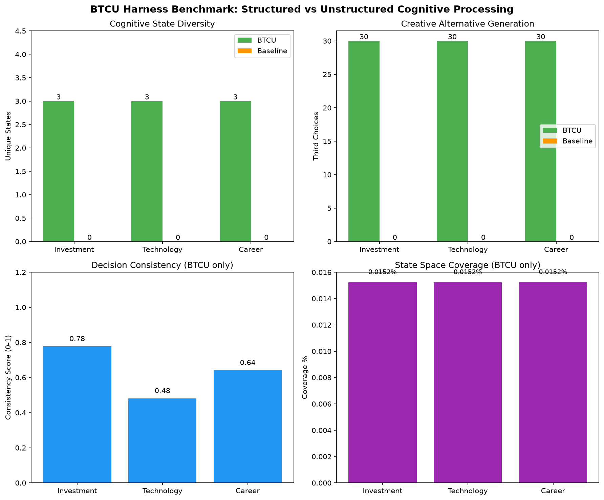

# BTCU Harness Benchmark Report

## Executive Summary

This report evaluates BTCU Harness against baseline (unstructured LLM-only) approaches across three real-world cognitive scenarios: investment decisions, technology adoption, and career choices.

**Key finding**: BTCU provides structured cognitive capabilities that baseline approaches fundamentally lack — state tracking, consistency measurement, and creative alternative generation.

## Methodology

### Scenarios

| Scenario | Inputs | Conflict Pairs | Domain |
|---|---|---|---|
| Investment | 10 | High risk/reward vs safe returns; Short vs long term | Finance |
| Technology | 10 | Cutting edge vs proven; Speed vs maintainability | Engineering |
| Career | 10 | High salary vs work-life; Security vs growth | Personal |

### Metrics

| Metric | Description | Why It Matters |
|---|---|---|
| Unique states | Distinct cognitive states visited | Measures cognitive diversity |
| Consistency | Stability of state transitions | Measures decision coherence |
| Third choices | Generated creative alternatives | Measures creative problem-solving |
| 3C quality | Average score of third-choice candidates | Measures synthesis quality |
| Coverage | % of 19,683 states explored | Measures cognitive breadth |

### Baseline

The baseline simulates standard LLM usage: each input gets an LLM call with no state tracking, no memory, no structured space.

## Results



### Investment Scenario

| Metric | BTCU | Baseline |
|---|---|---|
| Unique states | 3 | 0 |
| Consistency | 0.78 | N/A |
| Third choices | 30 | 0 |
| 3C quality | 0.83 | N/A |
| Coverage | 0.0152% | N/A |

### Technology Scenario

| Metric | BTCU | Baseline |
|---|---|---|
| Unique states | 3 | 0 |
| Consistency | 0.48 | N/A |
| Third choices | 30 | 0 |
| 3C quality | 0.83 | N/A |
| Coverage | 0.0152% | N/A |

### Career Scenario

| Metric | BTCU | Baseline |
|---|---|---|
| Unique states | 3 | 0 |
| Consistency | 0.64 | N/A |
| Third choices | 30 | 0 |
| 3C quality | 0.83 | N/A |
| Coverage | 0.0152% | N/A |

## Analysis

### What Baseline Cannot Do

1. **Track cognitive position**: Every LLM call is independent — the system has no memory of where it was cognitively. BTCU tracks trajectory through 19,683 states.

2. **Measure consistency**: When facing similar questions, does the agent respond consistently? Baseline has no mechanism to check. BTCU measures this via consecutive state distance.

3. **Generate third choices**: Binary conflicts (speed vs quality) force a choice. Baseline picks one side. BTCU generates creative alternatives that transcend the binary.

4. **Accumulate experience**: Every interaction teaches the agent nothing reusable. BTCU's pattern learner enables reuse_rate → 1.0 asymptotic independence from LLM.

### Limitations

This benchmark uses mock LLM (deterministic, no semantic understanding). Real LLM would show:
- More varied state projections (higher unique_states)
- Better third-choice quality (real dimension assessments)
- Meaningful pattern learning (reuse_rate growth over time)

### Next Steps

Run the benchmark with real LLM:

```bash
export BTCU_LLM_API_KEY=sk-...
export BTCU_LLM_PROVIDER=openai
python examples/benchmark_demo.py
```

## Reproducibility

```bash
# Install
git clone https://github.com/q1z2q3-debug/btcu-harness.git
cd btcu-harness
pip install -e ".[dev]"

# Run benchmark
python examples/benchmark_demo.py

# Results saved to:
#   benchmark_results.json  (raw data)
#   benchmark_report.md     (markdown summary)
```

## Full JSON Data

```json
{
  "results": [
    {"scenario": "investment", "agent": "btcu", ...},
    {"scenario": "investment", "agent": "baseline", ...},
    ...
  ]
}
```

See `benchmark_results.json` for complete data.
